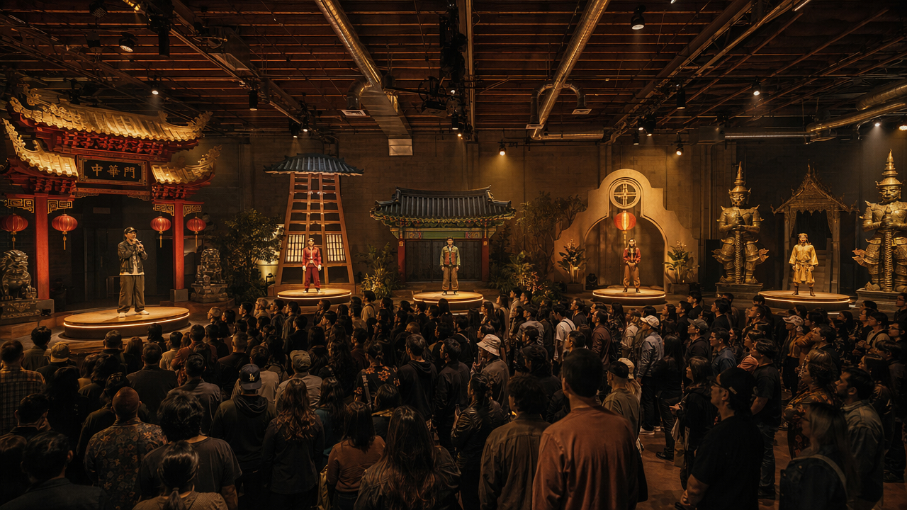

# If I Awaken in Los Angeles — Investor Tour

A static, single-page slideshow tour for an immersive theatre production. Built for investor pitches.

## Quick start

Open `index.html` in any modern browser. That's it. No build step, no server needed. The site uses Google Fonts via CDN — viewers need internet, but you can swap to a local font setup later if needed.

**Navigation:** scroll, mouse wheel, ↑↓ ←→ arrows, Page Up/Down, Space, Home/End. Press `Esc` to close the beat-sequence drawer.

**Plan views are interactive.** On every space slide, you can drag any element on the plan view (cast members, audience zones, scenic, seating rows) to try alternative blocking. Positions are saved to your browser's localStorage per space. A `Reset layout` button in the corner of each plan returns to the original blocking.

**Hero images are a carousel.** Each space slide has multiple reference images. The hero auto-advances every six seconds with a slow cross-fade. Hover or click any thumbnail beneath the hero to switch images; the carousel pauses while you're looking, then resumes.

**Edit mode (in-browser editing).** Click `Edit` in the top-right.
- All slide text — titles, subtitles, captions, beat descriptions, the bow tagline — becomes click-to-edit.
- Click a hero image to swap it with a file from your computer.
- Click `+` in the thumbnail strip to add an image to that space.
- Hover a thumbnail in edit mode and click the `×` to remove an image.
- Click `Save HTML` to download a new `index.html` containing all your edits. (Replaced/added images are embedded as base64 data, so the file may grow if you add many.) Drop the downloaded file back into this folder to make it the new live version.
- Click `Discard` to reload and lose unsaved edits.

## Files

```
index.html      All 14 slides + 7 beat drawers (one big, well-commented file)
styles.css      All visual styling, organized by slide section
script.js       Keyboard nav, scroll tracking, drawer open/close
images/         16 images — hero mockups + alts + lobby
README.md       This file
```

## How to make the three most common edits

### 1. Edit text

Open `index.html`. Each slide is a labeled `<section>` with an `EDIT:` comment near the top telling you what's there. Find the slide, edit the text directly between the tags. Save and reload.

For text that's repeated or used in nav labels, search-and-replace:
- The show title appears in `<title>`, the cover slide, the show-mark, and the closing slide.
- The director and composer names appear on the cover and closing slides.

### 2. Delete a slide

Find the slide's `<section class="slide ...">` block in `index.html` and delete the whole `<section>`. Two cleanup steps:
- In the `<nav class="side-nav">` block near the top of the file, delete the matching `<a class="nav-dot">` link.
- If you deleted a space slide, also delete its `<aside class="drawer">` block at the bottom of the file.
- (Optional) Renumber the remaining `slide-N` IDs and `nav-dot` links if you want sequential numbering, but the deck still works without it.

To remove the beat-sequence drawer feature from a single space, just delete the `<button class="beats-trigger">` inside that slide's `space-content` div.

### 3. Swap photos and plan views

**Hero photos** — every space slide has a line like:
```html

```
Replace the file at that path, or change the `src=` to point to a new file. Keep aspect ratios near 16:11 for best layout. The image caption appears just below in:
```html
<div class="space-image-cap">The arc · five towns at once</div>
```

**Plan views (SVG)** — each space slide contains its plan view as inline SVG, inside `<div class="space-plan">`. Replace the entire `<svg>...</svg>` block with a new one. The CSS will scale it to fit. The original plans are also in your `Space_N_Design.html` files — copy from there if you update them.

**Cover, Argument, and Bow background images** — these are set in `styles.css`, not `index.html`. Search the CSS file for:
- `.cover::before { background-image: url('images/space1-hero.jpg'); ... }`
- `.argument::before { background-image: url('images/space5-hero.jpg'); ... }`
- `.bow::before { background-image: url('images/space7-hero.jpg'); ... }`

Each has an `opacity` value you can tune (0–1) to make the background more or less visible.

## Slide order

| #  | Slide                       | Section in `index.html` |
|----|-----------------------------|--------------------------|
| 01 | Cover                       | `id="slide-1"`           |
| 02 | The Argument                | `id="slide-2"`           |
| 03 | By the Numbers              | `id="slide-3"`           |
| 04 | The Venue                   | `id="slide-4"`           |
| 05 | Lobby · Pre-show            | `id="slide-5"`           |
| 06 | Lobby · Post-show           | `id="slide-6"`           |
| 07 | Space 01 · Hollywood Blvd   | `id="slide-7"`           |
| 08 | Space 02 · Boyle Heights    | `id="slide-8"`           |
| 09 | Space 03 · Asian LA         | `id="slide-9"`           |
| 10 | Space 04 · Black LA         | `id="slide-10"`          |
| 11 | Space 05 · Folk LA          | `id="slide-11"`          |
| 12 | Space 06 · The Stage        | `id="slide-12"`          |
| 13 | Space 07 · The Real LA      | `id="slide-13"`          |
| 14 | The Bow                     | `id="slide-14"`          |

## Deploying

Anywhere that serves static files: GitHub Pages, Netlify, Vercel, Cloudflare Pages, S3, or just a folder on a web host. Drop the four files (`index.html`, `styles.css`, `script.js`, `images/`) and you're live.

## Design tokens

Everything visual is centralized at the top of `styles.css` under `:root`:

```css
--bg: #0a0908;          /* warm near-black background */
--gold: #d4a24c;        /* primary gold accent */
--gold-bright: #f0c674; /* highlight gold */
--ink: #ece4d4;         /* warm off-white body text */
--ink-dim: #a89c84;     /* muted secondary text */
```

Change one variable to retheme everything that uses it.

## Print / PDF export

Browser → Print → Save as PDF works. Each slide page-breaks cleanly. The side nav, progress indicator, and scroll hint are hidden in print. (For a polished investor deck PDF, set the page size to landscape A3 or 16:9 in your browser's print dialog.)
